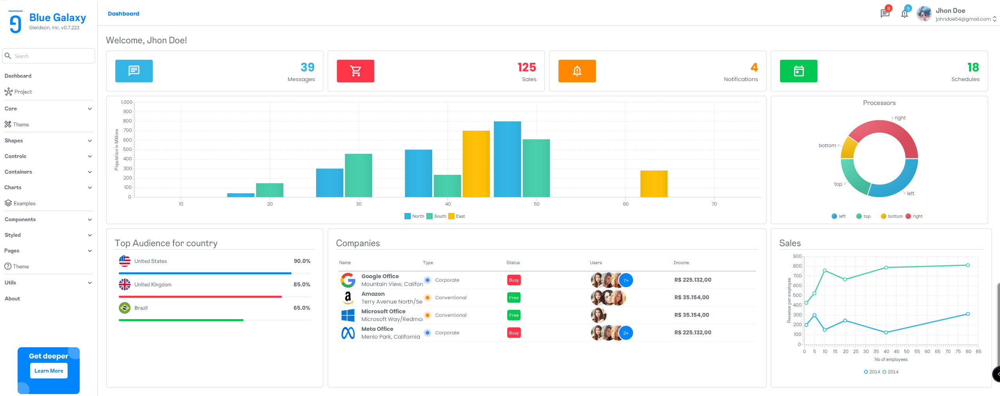

<h1 align="center">DashboardFx</h1>
<h1></h1>

[//]: # ([![News]&#40;https://img.shields.io/badge/News-1-brightgreen.svg?style=for-the-badge&#41;]&#40;http://gleidson28.blogspot.com&#41;)
[//]: # (![Version]&#40;https://img.shields.io/badge/Version-0.3.22-green.svg?style=for-the-badge&#41;)
[//]: # ([![Release]&#40;https://img.shields.io/badge/Release-v2.2.25-green.svg?style=for-the-badge&#41;]&#40;https://github.com/gleidsonmt/GNDecorator/releases/tag/2.1.25&#41;)

[//]: # (![Build]&#40;https://img.shields.io/badge/Build-2.2.24+258-gold.svg?style=for-the-badge&#41;)

  

<!-- TOC -->
* [📑 Overview](#-overview)
* [💻 Environment](#-environment)
* [🚀 Installing](#-installing)
* [☕ Using Dashboard](#-using-dashboard)
* [📺 On Youtube](#-on-youtube)
* [🛠 Enhancements](#-enhancements)
* [📫 Contributing to Project](#-contributing-to-project)
* [😄 Be a contritubutor ](#-be-a-contritubutorbr)
* [📝 License](#-license)
<!-- TOC -->

 

# 📑 Overview

Hy guys, I'm back, with more, after these years I looked for some things that can be really good-looking to build, and I want to share with you.
In this example, you can see how components in Javafx can be worked to align with a good design (I try). 
This time I use more time to create more tutorials and unify libs.

# 💻 Environment

This is a project build using JavaFx, Official website [JavaFx](https://openjfx.io/), Tutorial [Getting Started](https://openjfx.io/openjfx-docs/)

I've used a gradle 8.10 and Java and JavaFx +23 on Windows to build.
You'll find the jars in the folder called vendor.

# 🚀 Installing
I really recommend to use jpackage to create your jar and the .exe.  
!🗒️Note ** The generate you .exe you need the wix tool, you can get the url if you using intellij or from here  https://wixtoolset.org 🥸***
In intellij or visual studio (in visual you need to prepare the  ide to use javafx) it's really simple, only open the tab gradle and run the command build after jpackage.

# ☕ Using Dashboard
Just build and run -(º-º)- there's no trick.. only use gradle to build and run in your ide.
If you have problem, or a tip do an issue.
...
# 📺 On Youtube
...
# 🛠 Enhancements
...

# 📫 Contributing to Project
<!---Se o seu README for longo ou se você tiver algum processo ou etapas específicas que deseja que os contribuidores sigam, considere a criação de um arquivo CONTRIBUTING.md separado--->
To contributing to project, follow these steps:

1. Fork this repository.
2. Creates a branch: `git checkout -b <branch_name>`.
3. Do your changes and commit: `git commit -m '<commit_message>'`
4. Send a branch to origin: `git push origin DashboardFx / <local>`
5. Creates pull request.

However, if you don't know [How to create a pull Request](https://help.github.com/en/github/collaborating-with-issues-and-pull-requests/creating-a-pull-request).

# 😄 Be a contritubutor 

🤖I really need more friends.. Send me a  <a href='mailto:gleidisonmt@gmail.com?subject=Hi, I see you need my help!.. I am here.'> email <a/>.

# 📝 License

This project is under license. See the file [LICENSE](LICENSE) to more details.

[⬆ Back to the top](#DashboardFx) 
